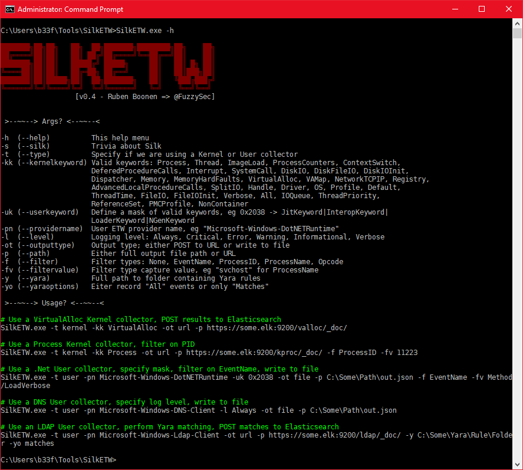
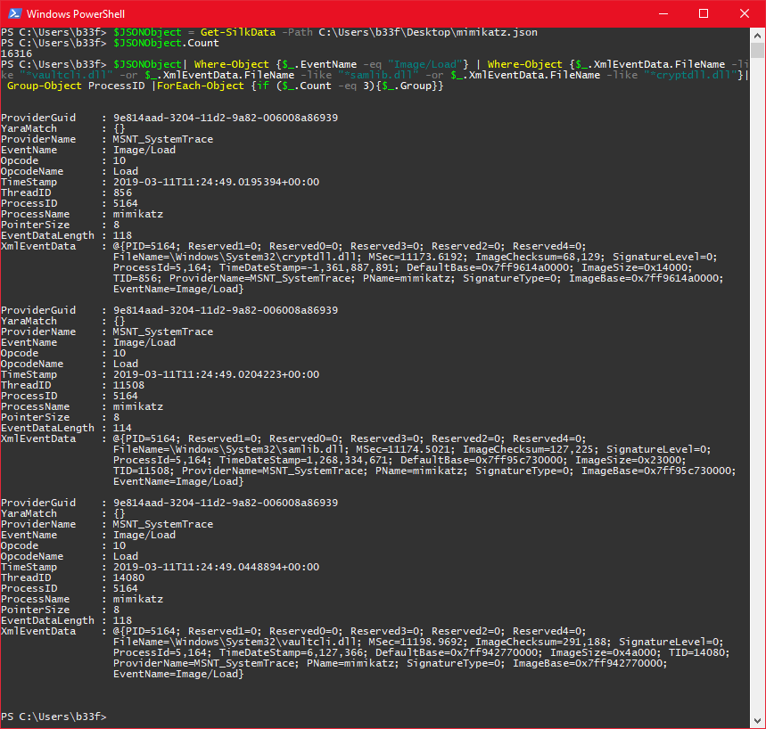
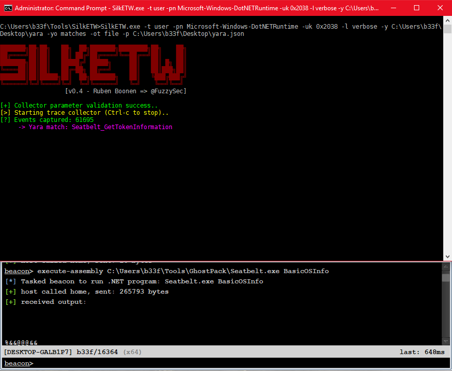

# SilkETW

SilkETW is a flexible C# wrapper for ETW, it is meant to abstract away the complexities of ETW and give people a simple interface to perform research and introspection. While SilkETW has obvious defensive (and offensive) applications it is primarily a research tool in it's current state.

For easy consumption, output data is serialized to JSON. The JSON data can either be analyzed locally using PowerShell or shipped off to 3rd party infrastructure such as [Elasticsearch](https://www.elastic.co/).

For more information on the future of SilkETW, see the [Roadmap](#roadmap) section.

## Implementation Details

### Libraries

SilkETW is buit on .Net v4.5 and uses a number of 3rd party libraries, as shown below. Please see [LICENSE-3RD-PARTY](LICENSE-3RD-PARTY.txt) for further details.

```
ModuleId                                 Version LicenseUrl                                                   
--------                                 ------- ----------                                                   
McMaster.Extensions.CommandLineUtils     2.3.2   https://licenses.nuget.org/Apache-2.0                        
Microsoft.Diagnostics.Tracing.TraceEvent 2.0.36  https://github.com/Microsoft/perfview/blob/master/LICENSE.TXT
Newtonsoft.Json                          12.0.1  https://licenses.nuget.org/MIT                               
System.ValueTuple                        4.4.0   https://github.com/dotnet/corefx/blob/master/LICENSE.TXT     
YaraSharp                                1.3.1   https://github.com/stellarbear/YaraSharp/blob/master/LICENSE
```

### Command Line Options

Command line usage is fairly straight forward and user input is validated in the execution prologue. See the image below for further details.



### JSON Output Structure

The JSON output, prior to serialization, is formatted according to the following C# struct.

```csharp
public struct EventRecordStruct
{
    public Guid ProviderGuid;
    public List<String> YaraMatch;
    public string ProviderName;
    public string EventName;
    public TraceEventOpcode Opcode;
    public string OpcodeName;
    public DateTime TimeStamp;
    public int ThreadID;
    public int ProcessID;
    public string ProcessName;
    public int PointerSize;
    public int EventDataLength;
    public Hashtable XmlEventData;
}
```

Note that, depending on the provider and the event type, you will have variable data in the XmlEventData hash table. Sample JSON output can be seen below for "Microsoft-Windows-Kernel-Process" -> "ThreadStop/Stop".

```json
{
   "ProviderGuid":"22fb2cd6-0e7b-422b-a0c7-2fad1fd0e716",
   "YaraMatch":[

   ],
   "ProviderName":"Microsoft-Windows-Kernel-Process",
   "EventName":"ThreadStop/Stop",
   "Opcode":2,
   "OpcodeName":"Stop",
   "TimeStamp":"2019-03-03T17:58:14.2862348+00:00",
   "ThreadID":11996,
   "ProcessID":8416,
   "ProcessName":"",
   "PointerSize":8,
   "EventDataLength":76,
   "XmlEventData":{
      "FormattedMessage":"Thread 11,996 (in Process 8,416) stopped. ",
      "StartAddr":"0x7fffe299a110",
      "ThreadID":"11,996",
      "UserStackLimit":"0x3d632000",
      "StackLimit":"0xfffff38632d39000",
      "MSec":"560.5709",
      "TebBase":"0x91c000",
      "CycleTime":"4,266,270",
      "ProcessID":"8,416",
      "PID":"8416",
      "StackBase":"0xfffff38632d40000",
      "SubProcessTag":"0",
      "TID":"11996",
      "ProviderName":"Microsoft-Windows-Kernel-Process",
      "PName":"",
      "UserStackBase":"0x3d640000",
      "EventName":"ThreadStop/Stop",
      "Win32StartAddr":"0x7fffe299a110"
   }
}
```

## Usage

### Filter data in PowerShell

You can import JSON output from SilkETW in PowerShell using the following simple function.

```powershell
function Get-SilkData {
	param($Path)
	$JSONObject = @()
	Get-Content $Path | ForEach-Object {
		$JSONObject += $_ | ConvertFrom-Json
	}
	$JSONObject
}
```

In the example below we will collect process event data from the Kernel provider and use image loads to identify Mimikatz execution. We can collect the required data with the following command.

```
SilkETW.exe -t kernel -kk ImageLoad -ot file -p C:\Users\b33f\Desktop\mimikatz.json
```

With data in hand it is easy to sort, grep and filter for the properties we are interested in.



### Yara

SilkETW includes Yara functionality to filter or tag event data. Again, this has obvious defensive capabilities but it can just as easily be used to augment your ETW research.

In this example we will use the following Yara rule to detect Seatbelt execution in memory through Cobalt Strike's execute-assembly.

```
rule Seatbelt_GetTokenInformation
{
	strings:
		$s1 = "ManagedInteropMethodName=GetTokenInformation" ascii wide nocase
		$s2 = "TOKEN_INFORMATION_CLASS" ascii wide nocase
		$s3 = /bool\(native int,valuetype \w+\.\w+\/\w+,native int,int32,int32&/
		$s4 = "locals (int32,int64,int64,int64,int64,int32& pinned,bool,int32)" ascii wide nocase
	
	condition:
		all of ($s*)
}
```

We can start collecting .Net ETW data with the following command. The "-yo" option here indicates that we should only write Yara matches to disk!

```
SilkETW.exe -t user -pn Microsoft-Windows-DotNETRuntime -uk 0x2038 -l verbose -y C:\Users\b33f\Desktop\yara -yo matches -ot file -p C:\Users\b33f\Desktop\yara.json
```

We can see at runtime that our Yara rule was hit.



Note also that we are only capturing a subset of the "Microsoft-Windows-DotNETRuntime" events (0x2038), specifically: JitKeyword, InteropKeyword, LoaderKeyword and NGenKeyword.

## Future Work

### Changelog

For details on version specific changes, please refer to the [Changelog](Changelog.txt).

### RoadMap

* Offer users the option to write trace data to disk as *.etl files.
* ~~Offer users the option to write trace data to the Windows event log.~~ **(v0.5)**
* Create a separate instance (SilkService) which can be deployed as a service with a configuration file.
* Suggestions welcome!